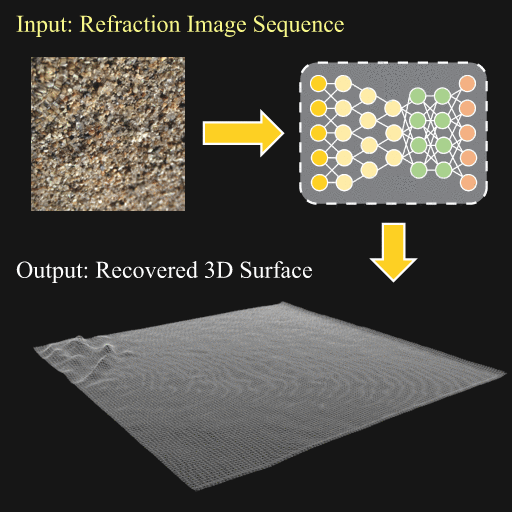
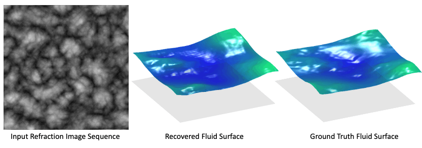

# Dynamic Fluid Surface Reconstruction Using Deep Neural Network
#### [Web Page](https://ivlab.cse.lsu.edu/FSRN_CVPR20.html) | [Paper](https://ivlab.cse.lsu.edu/pub/fluid_cvpr20.pdf)
[Simron Thapa](http://simronthapa.com/), [Nianyi Li](https://sites.duke.edu/nianyi/), [Jinwei Ye](https://ivlab.cse.lsu.edu/), Imaging and Vision Lab, Louisiana State University. In CVPR 2020 (oral).

<p float="left" align="middle">

</p>

We present a dynamic fluid surface reconstruction network that recovers time-varying 3D fluid surfaces from a single viewpoint.

## Contributions
1. We design physics-motivated loss functions for network training
2. We synthesize a large fluid dataset using physics-based modeling and rendering [Check out the folder "Fluid_wave_simulator". It is our synthetic data generation MatLab code.]
3. Our network is validated on real captured fluid data

## Datasets
Complete Training data will be made available soon.

[Training](https://ivlab.cse.lsu.edu/data/Train.tar), [Validation](https://ivlab.cse.lsu.edu/data/Validation.tar), [Testing](https://ivlab.cse.lsu.edu/data/Test.tar)

Please remember to cite the paper if you use this dataset.

## Training and Testing
The data preprocessing code (before training with FSRN-CNN) and data post-processing code for the predictions (before training with FSRN-RNN) will be made available soon.
```
python FSRN-CNN-train.py
python FSRN-RNN-train.py
```

## Evaluation
The code for evaluating the predictions with ground truth values. We use accuracy and error matrics.
```
python evaluate_metrics.py
```
## Results
1. Synthetic Results

<p float="left" align="middle">
  
   
</p>

2. Real Results

<p float="left" align="middle">
  
   
</p>

3. Re-rendered Results

<p float="left" align="middle">
  
   
</p>

## Citation

If you find this work useful, please consider citing:

```
@InProceedings{Thapa_2020_CVPR,
author = {Thapa, Simron and Li, Nianyi and Ye, Jinwei},
title = {Dynamic Fluid Surface Reconstruction Using Deep Neural Network},
booktitle = {The IEEE/CVF Conference on Computer Vision and Pattern Recognition (CVPR)},
month = {June},
year = {2020}
}
```
